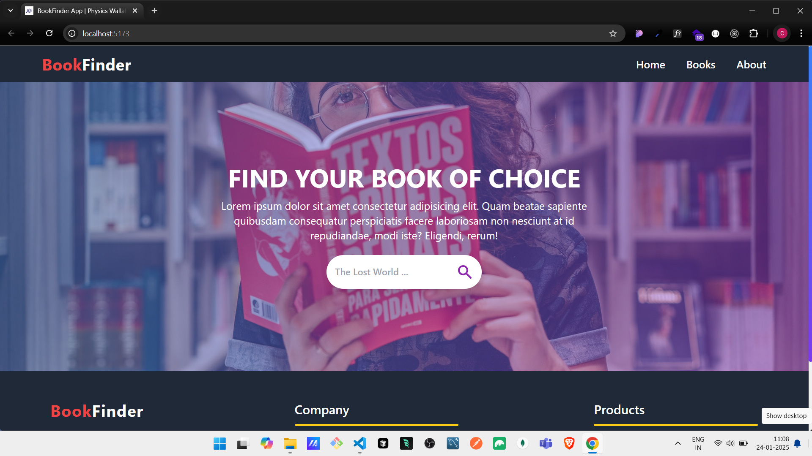
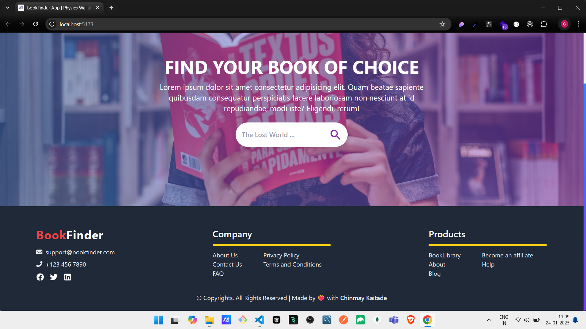
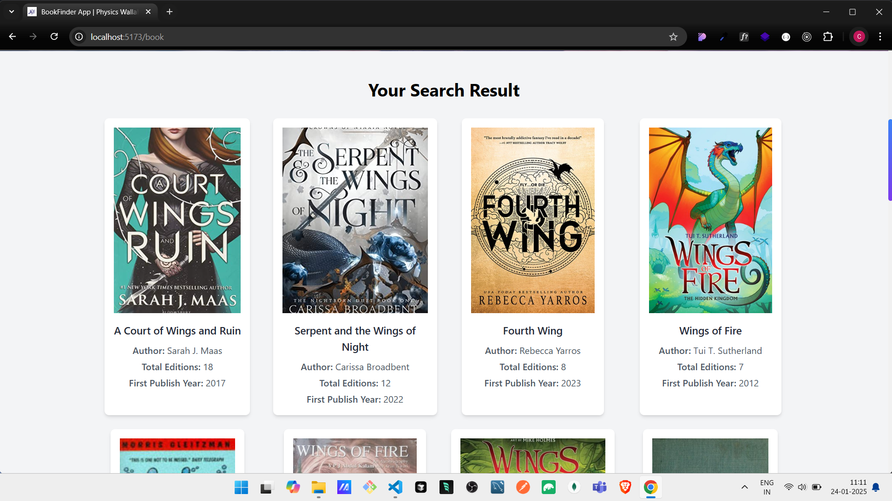
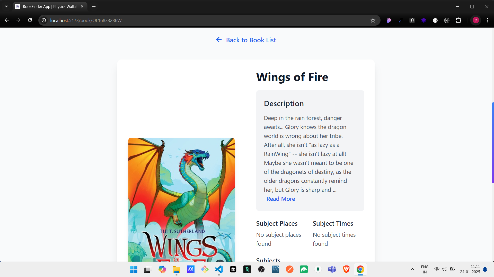
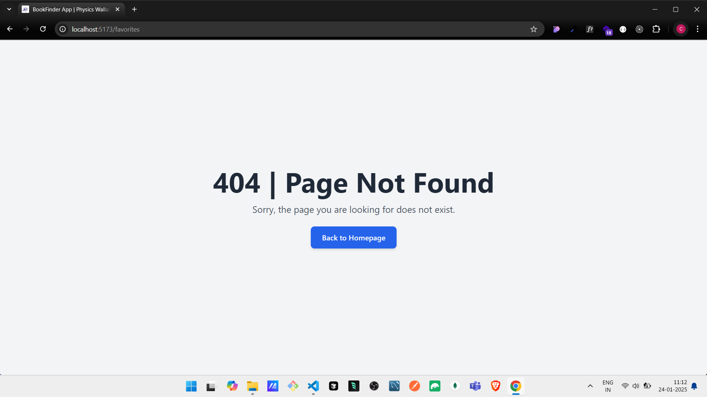

# E-book Library 🔥🚀


<div align="center">
	<a href="https://github.com/ChinmayKaitade/"></a>
	<h1>E-book Library</h1>
    
	
</div>

This is a frontend project for the **E-book Library** developed as part of my sample project while learningMERN. The application allows users to search for books and get details about them using the **Open Library API**. The frontend is built using **React** and styled with **Tailwind CSS**.

## 🚀 Features

- **Search books** by title, author, or subject.
- **Fetch book details** such as title, author(s), cover image, and publishing info.
- **Responsive UI** powered by Tailwind CSS.
- **Fast API integration** with Open Library API.
- **User-friendly and lightweight application.**

---

## 🛠️ Tech Stack

| Technology          | Description                         |
| ------------------- | ----------------------------------- |
| ⚛️ React.js         | JavaScript library for building UI  |
| 🎨 Tailwind CSS     | Utility-first CSS framework         |
| 📡 Open Library API | Fetches book data from Open Library |

---

## 💻 Machine Requirements

Ensure your system meets these requirements:

- **Node.js**: Version 16 or later
- **npm**: Version 8 or later
- **Browser**: Chrome, Edge, or Firefox (latest versions)

---

## 📸 Screenshots

### 🌟 Homepage



### 🌟 Footer



### 🌟 Search Results



### 🌟 Book Details



### 🌟 Not Found



---

## 🎥 Live Demo and Video Walkthrough

- **🔗 Live Application**: [Visit Book Finder App](https://bookfinderapplication.vercel.app/)
- **🎬 Video Walkthrough**: [Watch on YouTube](https://youtu.be/ARIKWJRoxsw?si=1iKdJz4xP5Njc3hE)

---


## 📌 Installation

### 1️⃣ Clone the Repository

```bash
git clone https://github.com/Saranshverma234/E-book_Library.git
cd E-book_Library
```

### 2️⃣ Install Dependencies

```bash
npm install
```

### 3️⃣ Start the Application

```bash
npm run dev
```

🚀 Open [http://localhost:5173](http://localhost:5173) in your browser.

---

## 🌍 API Documentation

This application uses the **Open Library API** to fetch book details.  
📖 [Explore Open Library API](https://openlibrary.org/developers)

---

## 📂 Folder Structure

```
📦 E-book Library
├── 📂 public/                # Static assets
├── 📂 src/
│   ├── 📂 components/        # Reusable components
│   ├── 📄 App.js             # Main app component
│   ├── 📄 index.js           # Entry point
│   ├── 📄 tailwind.config.js # Tailwind configuration
│   ├── 📄 api.js             # API call logic
├── 📄 package.json           # Project dependencies
└── 📄 README.md              # Documentation
```

---

## 📜 License

📝 This project is licensed under the **Apache-2.0 License**.

---

## 🙌 Acknowledgements

- 📖 **Open Library** for the API.
- 💙 **React & Tailwind CSS** for making UI development easy.

---

## 🔗 Connect with Me

<p>

<a href="https://www.linkedin.com/in/saransh-verma-4009752b7" target="_blank"></a>  
<a href="https://github.com/Saranshverma234" target="_blank"></a>
<a href="https://www.instagram.com/_____.skv._____" target="_blank"></a>
<a href="https://www.facebook.com/" target="_blank"></a>

</p>
